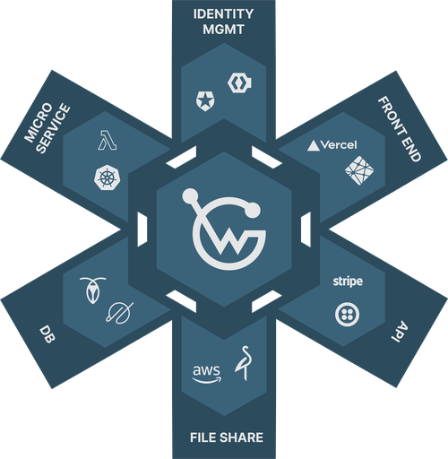
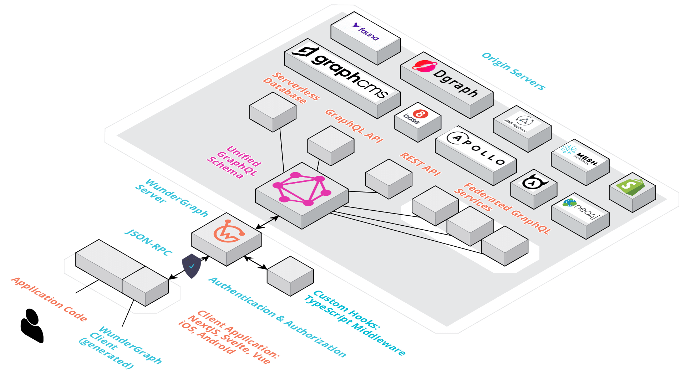

 

  <h1>WunderGraph</h1>
  
  
  
  
   
   
  <a href="https://wundergraph.com/docs/guides/getting_started/quickstart">Quickstart</a>
  &nbsp;&nbsp;•&nbsp;&nbsp;
  <a href="https://wundergraph.com/">Website</a>
  &nbsp;&nbsp;•&nbsp;&nbsp;
  <a href="https://wundergraph.com/docs">Docs</a>
  &nbsp;&nbsp;•&nbsp;&nbsp;
  <a href="https://wundergraph.com/docs/examples/nextjs_typescript_postgresql_realtime_chat">Examples</a>
  &nbsp;&nbsp;•&nbsp;&nbsp;
  <a href="https://wundergraph.com/blog">Blog</a>
  &nbsp;&nbsp;•&nbsp;&nbsp;
  <a href="https://discord.gg/Jjmc8TC">Discord</a>
  &nbsp;&nbsp;•&nbsp;&nbsp;
  <a href="https://twitter.com/wundergraphcom">Twitter</a>
   
  

## What is WunderGraph?

WunderGraph is the **Next-Generation API Developer Platform** with a focus on Developer Experience.

At its core, WunderGraph combines the [API Gateway pattern](https://microservices.io/patterns/apigateway.html) with
the [Backend for Frontend (BFF)](https://samnewman.io/patterns/architectural/bff/) pattern to create the perfect
Developer Experience for working with APIs.

Take all your (micro-)services, Databases, File Storages, Identity Providers as well as 3rd party APIs and combine them
into your own Firebase-like Developer Toolkit, without getting locked into a specific vendor.

Imagine that each of your applications could have its own dedicated BFF, while being able to share common logic across
all your applications, that's the WunderGraph Experience.

## Getting started

The fastest way to get started with WunderGraph is to open a Gitpod:

You can also following the [**Quickstart (5
min)**](https://wundergraph.com/docs/guides/getting_started/quickstart) if you don't want to use Gitpod.

## The WunderGraph Stack

WunderGraph is made up of the three core components:

- [**wunderctl**](./docs/wunderctl): A command line tool to create, deploy and manage your WunderGraph application.
- [**SDK**](./docs/sdk): Auto-generated and type-safe client to configure and interact with your WunderGraph.
- [**WunderHub**](https://hub.wundergraph.com/) The Package Manager for APIs that allows you to share and integrate your
  API's in a few clicks.

The auto-generated type-safe client can be used in _any_ Node.js or TypeScript backend application (including serverless
applications and microservices).

## Core features

- **Unified Graph**: Combine all your data sources into a unified GraphQL Schema.
- **JSON-RPC**: Expose GraphQL operations through JSON-RPC.
  Learn [more](https://wundergraph-landing-git-feat-update-landing-jensneuse.vercel.app/blog/graphql_is_not_meant_to_be_exposed_over_the_internet)
  about this design choice.
- **Type-Safe Clients**: Auto generate custom type-safe API Clients with Authentication / Authorization and file upload
  support.
- **Customizable**: Customizable gateway logic with TypeScript.
- **Standards**: Build upon standards like GraphQL, OpenAPI, OAuth2, S3...
- **Open Source**: 100% Open Source, No vendor lock-in.
- **Community**: First-class support for frameworks like Next.js, React, Svelte...

> **Note**: [WunderHub](https://hub.wundergraph.com/) is our vision of the Package Manager for APIs. Like npm, but for APIs. Sign up for free!

## Architecture & Key Differentiators

    

WunderGraph is unique in its design,
as we're not directly exposing GraphQL,
but JSON-RPC. Combined with a generated Type-Safe client,
this leads to a unique Developer Experience.
You can learn more about the architecture of WunderGraph and why we've built it this way in [the architecture section](docs/architecture/README.md).

## Learn more about WunderGraph

If you'd like to get a quick overview,
have a look at these [annotated example snippets](docs/at-a-glance/README.md).

## How does WunderGraph work

This section provides a high-level overview of how WunderGraph works and its most consumer centric components. For a
more thorough introduction, visit the [architecture](./docs/architecture) documentation.

After initializing your first WunderGraph application with `npx @wundergraph/wunderctl init`, you have a NPM package and
a `.wundergraph` folder. This folder contains the following files:

- `wundergraph.config.ts` - The primary config file for your WunderGraph application. Add data-sources and more.
- `wundergraph.operations.ts` - Configure authentication, caching and more for a specific or all operations.
- `wundergraph.server.ts` - The hooks server to hook into different lifecycle events of your gateway.

After configuring your data-sources, you can start writing operations. An operation is just a `*.graphql` file. The name
of the file will be the operation name. You can write queries, mutations and subscriptions that spans multiple
data-sources. Each operation will be exposed securely via HTTP JSON-API through the WunderGraph gateway. After writing
your operations, you can start deploying your WunderGraph application.

## Contributing

Read the [CONTRIBUTING.md](CONTRIBUTING.md) to learn how to contribute to WunderGraph.

## Security

We are thankful for any and all security reports. Please read the [SECURITY.md](SECURITY.md) to learn how to report any
security concerns to WunderGraph.

## Community & Support

- [GitHub Issues](https://github.com/wundergraph/wundergraph/issues). Best for: bugs and errors you encounter using WunderGraph.
- [Email Support](<info@wundergraph.com>). Best for: specific questions around WunderGraph as an early enterprise adopter.
- [Slack Support](<info@wundergraph.com>). Best for: problems with WunderGraph as an enterprise customer.
- [Discord](https://github.com/wundergraph/wundergraph/discussions). Best for: sharing your applications and hanging out with the community.

## Enterprise

We're a small but growing team of API Enthusiasts, thrilled to help you get the best Developer Experience of working
with APIs. Our Support Plans are tailored to help your teams get the most out of WunderGraph. We love building close relationships
with our customers, allowing us to continuously improve the product and iterate fast. Our sales team is available to talk with you about your project needs, pricing information, support plans, and
custom-built features.

Use
this [Link](https://form.typeform.com/to/fuRWxErj?typeform-embed-id=9220606329610526&typeform-embed=popup-blank&typeform-source=wundergraph.com&typeform-medium=embed-sdk&typeform-medium-version=next)
to contact our sales team for a demo.

