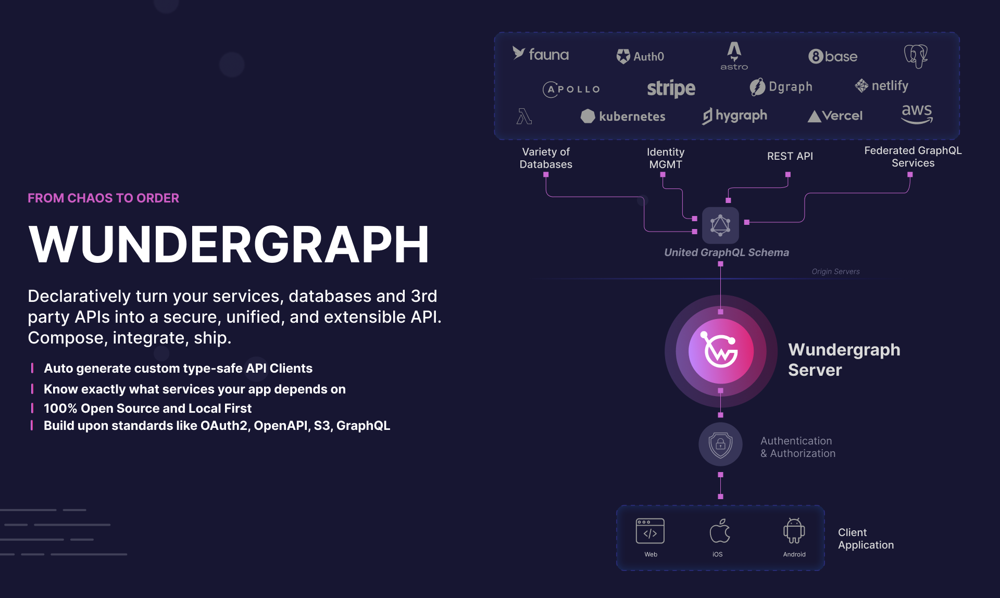
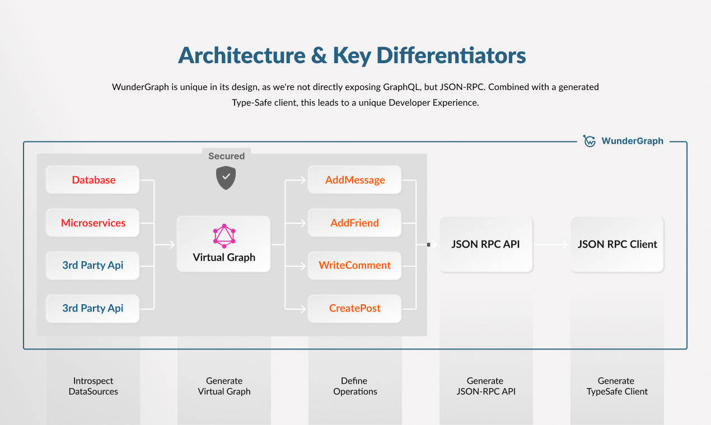

<div align="center">


[](https://github.com/wundergraph/wundergraph)
[](https://github.com/wundergraph/wundergraph/blob/main/CONTRIBUTING.md)
[](https://github.com/wundergraph/wundergraph/blob/main/LICENSE)
[](https://form.typeform.com/to/fuRWxErj?typeform-embed-id=8749569972809419&typeform-embed=popup-blank&typeform-source=wundergraph.com&typeform-medium=embed-sdk&typeform-medium-version=next)

[Quickstart](https://docs.wundergraph.com/getting-started)
<span>&nbsp;&nbsp;•&nbsp;&nbsp;</span>
[Website](https://wundergraph.com/)
<span>&nbsp;&nbsp;•&nbsp;&nbsp;</span>
[Docs](https://docs.wundergraph.com/docs)
<span>&nbsp;&nbsp;•&nbsp;&nbsp;</span>
[Examples](https://docs.wundergraph.com/docs/examples)
<span>&nbsp;&nbsp;•&nbsp;&nbsp;</span>
[Blog](https://wundergraph.com/blog)

[](https://wundergraph.com/)

[](https://community.wundergraph.com/)
[](https://discord.com/invite/Jjmc8TC)
[](https://twitter.com/wundergraphcom)

[Love WunderGraph? Give us a ⭐ on GitHub!](https://github.com/wundergraph/wundergraph)

</div>

## What is WunderGraph?

WunderGraph is a **Backend for Frontend (BFF) Framework** designed to optimize Developer Workflows through API Composition.

At its core, WunderGraph combines two patterns, [API Gateway](https://microservices.io/patterns/apigateway.html) and [BFF](https://samnewman.io/patterns/architectural/bff/)
with the concept of a package manager, making API composition as simple as npm install.
Our mantra is: **Compose, don't integrate**.

**API Composition** is a new pattern that allows you to interact with a heterogeneous set of APIs as if they were a single unified API.
This not just eliminates a lot of glue code, but also allows you to reason about the API Dependencies of an application.
Do you actually know what APIs and Services your application depends on?
WunderGraph can easily answer this question for you,
and even gives you analytics and observability into what APIs and Endpoints are used by your application and what the quality of service your API dependencies provide.

## WunderGraph in a nutshell

Here's how WunderGraph works:

1. **Compose your APIs**

```typescript
// .wundergraph/wundergraph.config.ts

import { NextJsTemplate } from '@wundergraph/nextjs/dist/template';

// introspect a PostgreSQL database
const pg = introspect.postgresql({
  apiNamespace: 'pg',
  databaseURL: new EnvironmentVariable('PG_DATABASE_URL'),
});

// introspect the Stripe API using OpenAPI
const stripe = introspect.openApiV2({
  apiNamespace: 'stripe',
  source: {
    kind: 'file',
    filePath: './stripe.yaml',
  },
  headers: (builder) => builder.addClientRequestHeader('Authorization', `Bearer ${process.env.STRIPE_SECRET_KEY}`),
});

// introspect the Shopify Storefront API using GraphQL
const shopify = introspect.graphql({
  apiNamespace: 'shopify',
  url: 'https://my-shop.myshopify.com/api/2021-07/graphql.json',
  headers: (builder) =>
    builder.addStaticHeader('X-Shopify-Storefront-Access-Token', new EnvironmentVariable('SHOPIFY_STOREFRONT_TOKEN')),
});

configureWunderGraphApplication({
  // compose the APIs into a unified WunderGraph API
  apis: [pg, stripe, shopify],

  // generate type-safe clients for your Frontend
  codeGenerators: [
    {
      templates: [new NextJsTemplate()],
      path: '../web/components/generated',
    },
  ],
});
```

WunderGraph allows you to create a code pipeline to introspect and compose multiple APIs into a unified API.
This makes it easy to update an API dependency without a single click.

2. **Define an Operation**

By combining the introspected APIs, WunderGraph generates a unified GraphQL Schema across all APIs.
All we have to do is define an Operation and call it from our Frontend. You can create a GraphQL operation or a TypeScript operation. Both are type-safe.
TypeScript operations allows you to add custom logic e.g aggregating data from multiple APIs, defining custom input validation, etc.

<table>
<tr>
<td> GraphQL </td> <td> TypeScript</td>
</tr>
<tr>
<td valign="top">

```graphql
# .wundergraph/operations/users/ByID.graphql
query ($id: String!) {
  user: pg_findFirstUser(where: { id: { equals: $id } }) {
    id
    email
    name
    bio
  }
}
```

</td><td valign="top">

```typescript
// .wundergraph/operations/users/CustomByID.ts
import { createOperation, z } from '../../generated/wundergraph.factory';

export default createOperation.query({
  // Input validation
  input: z.object({
    id: z.string(),
  }),
  handler: async ({ input }) => {
    // Call into your virtual graph, type-safe
    const { errors, data } = await operations.query({
      operationName: 'users/ByID',
      input: {
        id: input.id,
      },
    });

    return {
      ...data,
    };
  },
});
```

</tr></table>

3. **Call the Operation** from your Frontend

As you define Operations, WunderGraph automatically generates a type-safe client for your Frontend,
supporting all major Frontend Frameworks like React, NextJS, Remix, Astro, Svelte, Expo, Vue, etc...

```typescript jsx
// web/pages/profile.ts

import { useQuery } from '../../components/generated/nextjs';

export default async function ProfilePage(props) {
  const { data } = await useQuery({
    operationName: 'users/CustomByID', // or 'users/ByID'
    input: {
      id: props.params.id,
    },
  });

  return (
    <div>
      <h1>{data.user.id}</h1>
      <p>{data.user.name}</p>
    </div>
  );
}
```

In the same vein, you could now add Authentication, Authorization, file uploads, etc...

## Getting started

The easiest way to get started from scratch is to use the following command:

```shell
npx create-wundergraph-app my-project --example nextjs
```

If you already have an existing project, you can add WunderGraph to it by running:

```shell
npx create-wundergraph-app --init
```

## Examples:

We've got a comprehensive list of examples to get you started.
The best way to try them out is by cloning the mono-repo.

- [Apollo Federation](examples/apollo-federation)
- [Astro](examples/astro)
- [Auth0 OpenID Connect Authentication](examples/auth0-oidc-authentication)
- [Caching](examples/caching)
- [Cross API Joins](examples/cross-api-joins)
- [Expo swr](examples/expo-swr)
- [Expo Relay](examples/expo-relay)
- [FaunaDB NextJS](examples/faunadb-nextjs)
- [Fragments](examples/fragments)
- [Golang Client](examples/golang-client)
- [Apollo Subscriptions](examples/graphql-apollo-subscriptions)
- [Hasura Subscriptions](examples/graphql-hasura-subscriptions)
- [SSE Subscriptions](examples/graphql-sse-subscriptions)
- [Subscriptions Hooks](examples/graphql-subscriptions-hooks)
- [WebSocket Subscriptions](examples/graphql-ws-subscriptions)
- [GraphQL Yoga SSE Subscriptions](examples/graphql-yoga-sse-subscriptions)
- [Hooks](examples/hooks)
- [Inject Bearer Token](examples/inject-bearer)
- [Keycloak OIDC Authentication](examples/keycloak-oidc-authentication)
- [Learn WUnderGraph](examples/learn-wundergraph)
- [Migrate from Apollo](examples/migrate-from-apollo)
- [Next.js](examples/nextjs)
- [Next.js file upload](examples/nextjs-file-upload)
- [Next.js PostgresSQL Prisma](examples/nextjs-postgres-prisma)
- [Next.js PostgresQL user filters](examples/nextjs-postgres-user-filters)
- [Next.js React Query](examples/nextjs-react-query)
- [Next.js Relay](examples/nextjs-relay)
- [Next.js Todos](examples/nextjs-todos)
- [Next.js TypeScript Operations](examples/nextjs-typescript-functions)
- [Next.js Clerk Authentication](examples/nextjs-clerk)
- [NodeJS TypeScript Client](examples/nodejs-ts-client)
- [Nuxt Vue Query](examples/nuxt-vue-query)
- [OpenAPI Mocking](examples/openapi-mocking)
- [PostgreSQL](examples/postgres)
- [Role based Access control](examples/rbac)
- [Remix](examples/remix)
- [Schema Extension](examples/schema-extension)
- [Simple Example](examples/simple)
- [SvelteKit](examples/sveltekit)
- [Vite SolidJS](examples/vite-solidjs)
- [Vite Svelte](examples/vite-svelte)
- [Vite swr](examples/vite-swr)
- [Vite React Relay](examples/vite-react-relay)
- [Webhooks](examples/webhooks)

## Advanced Examples:

- [Use Turborepo to speed up builds in monorepos.](https://github.com/wundergraph/cloud-starter-turbo)
- [Manage multiple WunderGraph Cloud Projects in a single repository](https://github.com/wundergraph/cloud-multi-projects-demo)

## The WunderGraph Stack

WunderGraph is made up of the three core components:

- [**wunderctl**](packages/wunderctl): A command line tool to create, deploy and manage your WunderGraph application.
- [**SDK**](packages/sdk): Create, configure & extend your WunderGraph Application with TypeScript.

## Core features

- **APIs as Dependencies** - Define which data sources your frontend depends on and WunderGraph handles the rest. Say goodbye to unmaintainable glue-code, focus on **adding real business value**.
- **Backend for Frontend Architecture** - WunderGraph lives next to your frontend code, but can also be used stand alone as an API Gateway. Whatever you're building, you can always depend on the same **great DX**.
- **End-to-End-TypeSafety** - Start new projects in minutes with powerful conventions and code generation. WunderGraph generates **instant, typesafe API clients**, including authentication and file uploads.
- **API Composition with Namespacing** - WunderGraph is the only tool that allows you to **compose multiple APIs** into a single unified API without naming collisions or manual configuration thanks to **API namespacing**.

## Architecture & Key Differentiators

<div align="center">
    
</div>

You can learn more about the architecture of WunderGraph and why we’ve built it this way in [the architecture section](docs/architecture.md).

## How does WunderGraph work

This section provides a high-level overview of how WunderGraph works and its most consumer centric components. For a
more thorough introduction, visit the [architecture](./docs/architecture) documentation.

After initializing your WunderGraph application, you have a NPM package and
a `.wundergraph` folder. This folder contains the following files:

- `wundergraph.config.ts` - The primary config file for your WunderGraph application. Add data-sources and more.
- `wundergraph.operations.ts` - Configure authentication, caching and more for a specific or all operations.
- `wundergraph.server.ts` - The hooks server to hook into different lifecycle events of your gateway.

As a user of WunderGraph, you add your data-sources and authentication configuration to the `wundergraph.config.ts` file.
You will then define your Operations by creating either a `*.graphql` or `*.ts` file in the `.wundergraph/operations/` directory.
Using GraphQL, you can directly interact with the GraphQL Schema of your data-sources.
If you'd like to add more customization, you can also use TypeScript to define custom operations.

All Operations are then compiled into JSON-RPC and served by the WunderGraph Gateway.
You can either use one of the generated type-safe clients, or try out the API using the Postman Collection or OpenAPI Specification which will be generated in the `.wundergraph/generated` directory.

## Contributing

Read the [CONTRIBUTING.md](CONTRIBUTING.md) to learn how to contribute to WunderGraph.

## Security

We are thankful for any and all security reports. Please read the [SECURITY.md](SECURITY.md) to learn how to report any
security concerns to WunderGraph.

## Community & Support

- [GitHub Issues](https://github.com/wundergraph/wundergraph/issues). Best for: bugs and errors you encounter using WunderGraph.
- [Email Support](mailto:info@wundergraph.com). Best for: specific questions around WunderGraph as an early enterprise adopter.
- [Slack Support](mailto:info@wundergraph.com). Best for: problems with WunderGraph as an enterprise customer.
- [Discord](https://discord.gg/Jjmc8TC). Best for: sharing your applications and hanging out with the community.
- [Feedback and Feature Requests](https://wundergraph.canny.io/). Best for: discussing and voting on feature requests and giving feedback to our developers.

## Enterprise

We're a small but growing team of API Enthusiasts, thrilled to help you get the best Developer Experience of working
with APIs. Our Support Plans are tailored to help your teams get the most out of WunderGraph. We love building close relationships
with our customers, allowing us to continuously improve the product and iterate fast. Our sales team is available to talk with you about your project needs, pricing information, support plans, and
custom-built features.

Use this [Link](https://form.typeform.com/to/fuRWxErj?typeform-embed-id=9220606329610526&typeform-embed=popup-blank&typeform-source=wundergraph.com&typeform-medium=embed-sdk&typeform-medium-version=next)
to contact our sales team for a demo.
